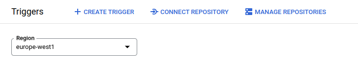
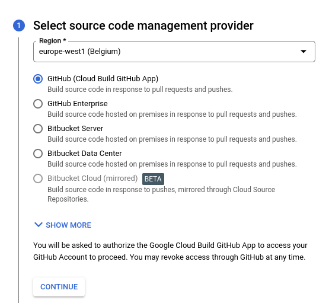
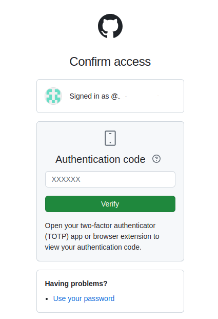
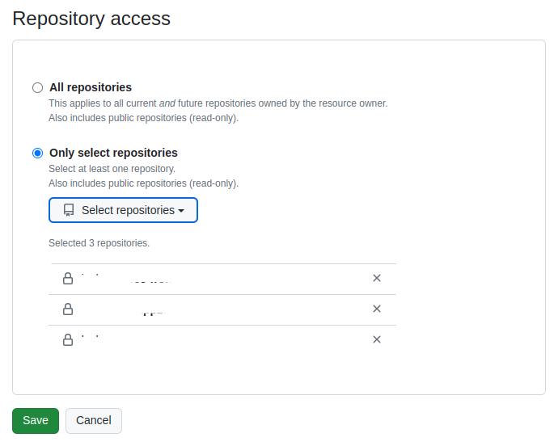
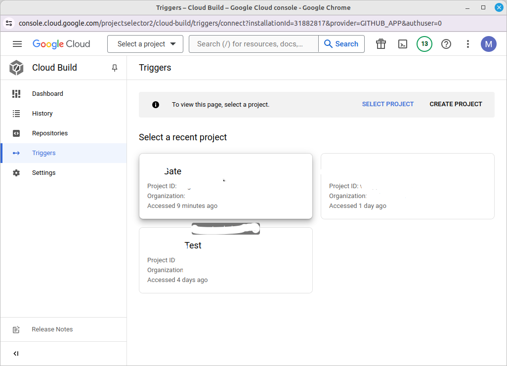
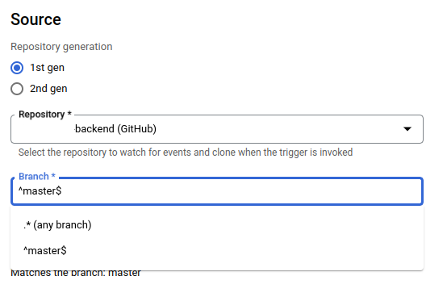
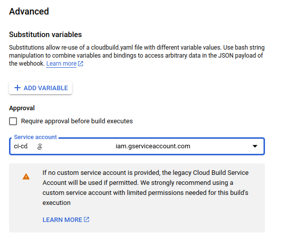
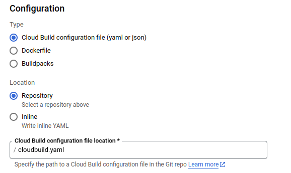

### What is Google Cloud Build?

Cloud Build executes your build as a series of build steps, where each build step is run in a Docker container. Executing build steps is analogous to executing commands in a script. You can read more about it on the official **[Google Website](https://cloud.google.com/build/docs/overview)**. 
    
I have used it before for building images as part of a pipeline, but not much more. Now, I will try to show you the full scope of what can be done with Cloud Build without spending on additional runners in GitHub or GitLab for code builds.

I want to note that for building images, we can connect high-performance machines using the `machineType` option and easily deploy the build to Cloud Run, App Engine, Cloud Functions, Anthos/GKE, Compute Engine, and Firebase.

In this publication, an example of deploying to Cloud Run is considered.

### Let's get started
Go to GCP service **[Cloud Build Trigger](https://console.cloud.google.com/cloud-build/triggers)**

Push on bottom `CONNECT REPOSITORY`   



In mostly case choose `GitHub (Cloud Build GitHub App)`    



Pass Authentication on GitHub side         



Select which project need to add in Cloud Build and tap `Save` bottom



Go back to GCP page and select GCP Project whom will be linked with GitHub Project  




Push on bottom `CREATE TRIGGER`      


Fill all filed, pay attention on Section `Source` after you choose repository you can define branch all several branches for Cloud Build using regexp




In `Advanced` section I recommend created before Service Account grant necessary roles and using it in Build Steps for Cloud Build




In `Configuration` section defined filename with instruction for Cloud Build, by default file have name `cloudbuild.yaml`. This file by default need to put in root of branch where is plan get instruction Cloud Build



File `cloudbuild.yaml` with example instruction bellow and located on GitHub Repo

```yaml
# https://cloud.google.com/build/docs/configuring-builds/substitute-variable-values

options:
  logging: CLOUD_LOGGING_ONLY
  dynamicSubstitutions: true

substitutions:
  _GCP_SERVICE: 'gcp-service'
  _REGION: 'europe-west1'
  _IMAGE_NAME: '${_REGION}-docker.pkg.dev/${PROJECT_ID}/${_GCP_SERVICE}/${_GCP_SERVICE}'
  _ENV_FILE: .env
  _ENV: DEV

steps:
  # Step 1: Display content of .env file
  - name: 'gcr.io/cloud-builders/gcloud'
    entrypoint: 'bash'
    args:
      - '-c'
      - 'cat ${_ENV_FILE}'

  # Step 2: Build the Docker image with tags
  - name: 'gcr.io/cloud-builders/docker'
    args:
      [
        'build',
        '-t', '${_IMAGE_NAME}:${SHORT_SHA}',
        '-t', '${_IMAGE_NAME}:${_ENV}',
        '-t', '${_IMAGE_NAME}:latest',
        '.',
      ]

  # Step 3: Push the Docker image to Google Artifact Registry
  - name: 'gcr.io/cloud-builders/docker'
    args:
      [
        'push',
        '${_IMAGE_NAME}', '--all-tags'
      ]

  # Step 4: Deploy built container image to Cloud Run
  - name: 'gcr.io/google.com/cloudsdktool/cloud-sdk'
    entrypoint: gcloud
    args: ['run', 'deploy', '${_GCP_SERVICE}', '--image', '${_IMAGE_NAME}:${SHORT_SHA}', '--region', '${_REGION}']

images:
  - '${_IMAGE_NAME}'
```

**Build History** available via **[link](https://console.cloud.google.com/cloud-build/builds)**
